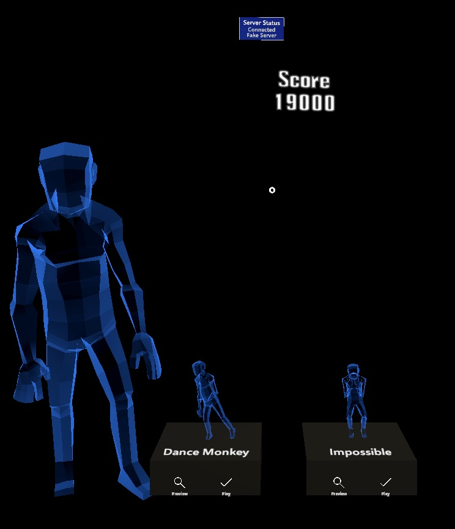

# ARDanceGame

## Requirements
A Computer with a powerful nvidia GPU (GTX 980 and above), a Microsoft Azure Kinect and preferably a Microsoft Hololens 2. Although it can be run fully in the Unity emulator.

## Get Started
1. Clone this repository.
2. Open the folder as a Unity project, with `Universal Windows Platform` as well as `Windows Standalone` build support modules. It might take a while to fetch all packages.
3. Setup the Azure Kinect Libraries: (same as [Sample Unity Body Tracking Application](https://github.com/microsoft/Azure-Kinect-Samples/tree/master/body-tracking-samples/sample_unity_bodytracking))
    1. Manually install the Azure Kinect Body Tracking SDK v1.1.0 [Link](https://docs.microsoft.com/en-us/azure/kinect-dk/body-sdk-download)
    2. Get the NuGet packages of libraries:
        - Open the Visual Studio Solution (.sln) associated with this project. You can create one by opening a csharp file in the Unity Editor.
        - In Visual Studio open: Tools->NuGet Package Manager-> Package Manager Console
        - When Prompted to get missing packages, click confirm. Alternatively, run `Update-Package -reinstall` in the Package Manager Console.
    5. Move libraries to correct folders:
        - Execute the file `MoveLibraryFile.bat`. Check the log if all files have been copied successfully. You should now have library files in the project folder and in the newly created `Assets/Plugins`.
3. Open `Scenes/Client` in the Unity Editor.
4. When prompted to import TextMesh Pro, select `Import TMP Essentials`. You will need to reopen the scene to fix visual glitches.

Since the program architecture requires a server and a client (server for handling the Kinect, client for the Hololens), one of the two must be built and run outside of the Unity Editor. Although they can be run on the same computer. For the best experience, follow the [Unity Hololens 2 build Guide](https://docs.microsoft.com/en-us/windows/mixed-reality/develop/advanced-concepts/using-visual-studio?tabs=hl2) to build a hololens app package and sideload it onto the hololens. Alternatively, one can build a Windows Standalone Executable containing the Server Scene only [(follow these instructions also)](https://github.com/microsoft/Azure-Kinect-Samples/tree/master/body-tracking-samples/sample_unity_bodytracking#finally-if-you-build-a-standalone-executable) and use the Client scene with [hologhaphic remoting](https://docs.microsoft.com/en-us/windows/mixed-reality/develop/unity/unity-play-mode?tabs=openxr) within the editor. The Client can also be run without any server, altough this means the Kinect will not be used to score the player.

## Running the Game
Ensure that both Client and Server are in the same network (eg same wifi). Start and maybe restart (see Troubleshooting) the Server until the output shows a correctly tracked hologram. Position the player 3 meters in front of the Azure kinect with the player facing the kinect directly. Make sure there is enough space around the player. Then start the client. The client will then connect to the server. This can be seen in the Server onscreen logs and on the server status bar at the ceiling of the hololens space. The player can use the Hololens hand controls to move the Hologram and the Scoring Display to a fitting position in front of them. We recommend to keep a certain distance to stay within the FOV. Once the connection has been established the player can preview and choose a song to be played. The player should always try to stay in the visibility of the kinect camera.

The game will also work without a server. The server status bar will then report a 'fake server' upon starting a Song without any connection and alywas report a perfect score.

## Troubleshooting
### Server
The Azure Kinect Body Tracking implementation is very fragile and suffers from latency and initialization issues under certain conditions, eg. [1682](https://github.com/microsoft/Azure-Kinect-Sensor-SDK/issues/1682). This means that the server is sometimes hard to get running. We did our best to increase the chances of a successful launch, but can not guarantee it. The server is correctly running as soon as the Unity output shows a hologram with the correctly tracked output of the kinect. If no hologram is visible or the hologram is T-Posing, restart the application until it works. Switching USB ports can also help. It may also help to try out a built version, or the in Editor version. Switching Driver Versions has also shown some effect.

The procedure with the highest success rate is: Unplug the Kinect from the computer. Launch the server and wait until the logs are shown on screen. Then plug in the Kinect and wait for about 5 seconds until the server has found and startet the camera and tracker.
